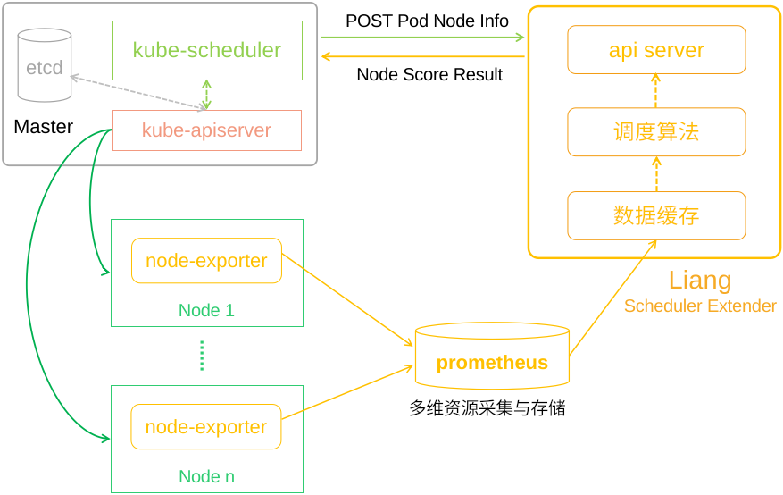
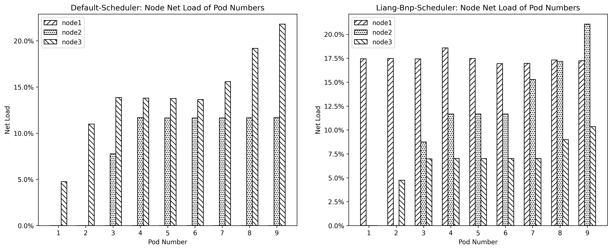
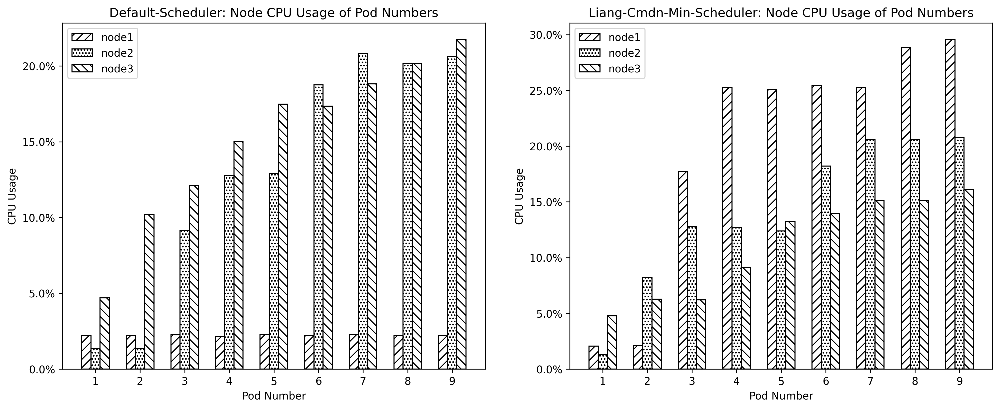

# Liang
>A Kubernetes Scheduer Extender with two Customed Scheduling Algorithms BNP and CMDN.

Kubernetes has become the de-facto container cluster management system with its rich enterprise and production-level features. However, Kubernetes' default scheduling algorithms are designed for general scenarios. For customed scenarios, this project proposes a scheduler extender named `Liang` and implements two example algorithms BNP and CMDN.



Config file for kubernetes scheduler is:
```json
{
    "kind": "Policy",
    "apiVersion": "v1",
    "extenders": [
        {
            "urlPrefix": "http://localhost:8000/v1",
            "prioritizeVerb": "prioritizeVerb",
            "weight": 1,
            "enableHttps": false,
            "httpTimeout": 1000000000,
            "nodeCacheCapable": true,
            "ignorable": false
        }
    ]
}
```

# Customed Kubernetes Scheduling Algorithm
## Balanced NetIO Priority (BNP)
BNP adds network IO resource request and combines the network information of candidate nodes to select the best node. BNP makes the overall network IO usage of the cluster more balanced and reduces the container deployment time.



## CMDN
Multi-criteria resources scheduling algorithm CMDN is based on TOPSIS decision algorithm. The CMDN algorithm takes CPU utilization, memory utilization, disk IO, network IO and NIC bandwidth of candidate nodes into account. It then scores nodes comprehensively using TOPSIS algorithm which brings two scheduling effects of multi-criteria resource balancing and compactness.



The experiments show that BNP Algorithm improves the balance level of cluster  network IO, prevents nodes from network IO bottlenecks, and also reduces the container deployment time by 32%. The CMDN Algorithm can balance the multi-criteria resource utilization such as CPU, Memory, disk IO and network IO of the cluster nodes in balancing policy. It also reduces container deployment time by 21%. The CMDN Algorithm can schedule containers to the nodes with high multidi-criteria resource utilization in the compact policy which achieves the expected results.

# Reference
- [prom go SDK](https://github.com/prometheus/client_golang)
- [kratos v0.6.0](https://github.com/go-kratos/kratos/tree/v1.0.0)
- [kratos v1 docs](https://v1.go-kratos.dev/#/kratos-tool)